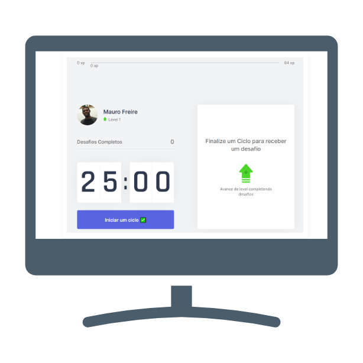

<h1 align="center">
    
</h1>

## Tecnologias

Esse projeto foi desenvolvido com as seguintes tecnologias:

- [Node.js](https://nodejs.org/en/)
- [Next.js](https://nextjs.org/)
- [React](https://reactjs.org)
- [TypeScript](https://www.typescriptlang.org/)

## Projeto

Desenvolvido pela Rocketseat, no evento nwl#04. Com alteraçõe pessoais

## Layout

    

